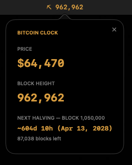

# Bitcoin Clock

A tiny macOS menu bar app showing live Bitcoin block height, price, and time until the next halving.



## Features

- Menu bar shows current block height (⛏ prefix, Bitcoin-orange text)
- Popover with:
  - BTC price (USD)
  - Block height
  - Next halving block + ETA (based on 10-min average block time)
- Data from [mempool.space](https://mempool.space) public API
  - Price refreshes every 15s
  - Block height refreshes every 30s

- Launches at login automatically (via `SMAppService`)

## Install (non-technical users)

Grab the latest `.dmg` from [Releases](../../releases), open it, drag **Bitcoin Clock** into Applications.

The app is ad-hoc signed (no Apple Developer account), so macOS Gatekeeper will block the first launch. Right-click the app → **Open** → **Open** again in the dialog. Only needed once.

## Requirements

- macOS 13+
- Swift 5.9+ (Xcode or Swift toolchain)

## Build & Run (dev)

```bash
swift run
```

This launches the app as a menu bar accessory (no Dock icon). Click the menu bar item to open the popover; click the `×` in the popover to quit.

## Build a release .dmg

```bash
./scripts/build-dmg.sh 1.0.0
```

Produces a universal (arm64 + x86_64) app bundle, ad-hoc signs it, and packages `.build/dist/BitcoinClock-<version>.dmg`.

## Project structure

```
Sources/BitcoinClock/
  main.swift            entry point
  AppDelegate.swift      status item + popover wiring
  BitcoinService.swift   polls mempool.space for price/block height
  ContentView.swift      popover UI
  BitcoinPalette.swift   shared Bitcoin-orange color
```
